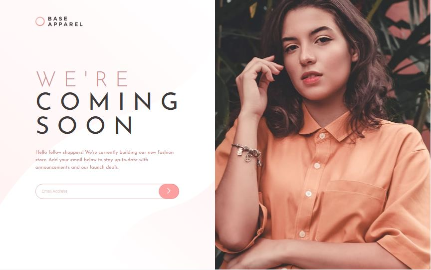
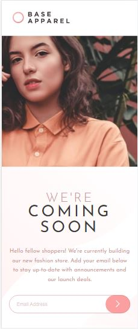

# Frontend Mentor - Base Apparel coming soon page solution

This is a solution to the [Base Apparel coming soon page challenge on Frontend Mentor](https://www.frontendmentor.io/challenges/base-apparel-coming-soon-page-5d46b47f8db8a7063f9331a0). Frontend Mentor challenges help you improve your coding skills by building realistic projects. 

## Table of contents

- [Overview](#overview)
  - [The challenge](#the-challenge)
  - [Screenshots](#screenshots)
  - [Links](#links)
- [My process](#my-process)
  - [Built with](#built-with)
- [Author](#author)

## Overview

### The challenge

Users should be able to:

- View the optimal layout for the site depending on their device's screen size
- See hover states for all interactive elements on the page
- Receive an error message when the `form` is submitted if:
  - The `input` field is empty
  - The email address is not formatted correctly

### Screenshots
- Desktop View

- Active State

- Mobile View

### Links

- Solution URL: [see my solution to this challenge](https://www.frontendmentor.io/solutions/responsive-coming-soon-page-using-css-and-javascript-coM5ak9q01)
- Live Site URL: Live Site URL: [view live site](https://damola-147.github.io/base-apparel-coming-soon-page/)

## My process

### Built with

- Semantic HTML5 markup
- CSS custom properties
- Flexbox
- Mobile-first workflow

## Author

- GitHub - [Damola-147](https://github.com/Damola-147)
- Frontend Mentor - [@Damola-147](https://www.frontendmentor.io/profile/Damola-147/)
- Twitter - [@adebiyi_stoke](https://www.twitter.com/adebiyi_stoke/)
